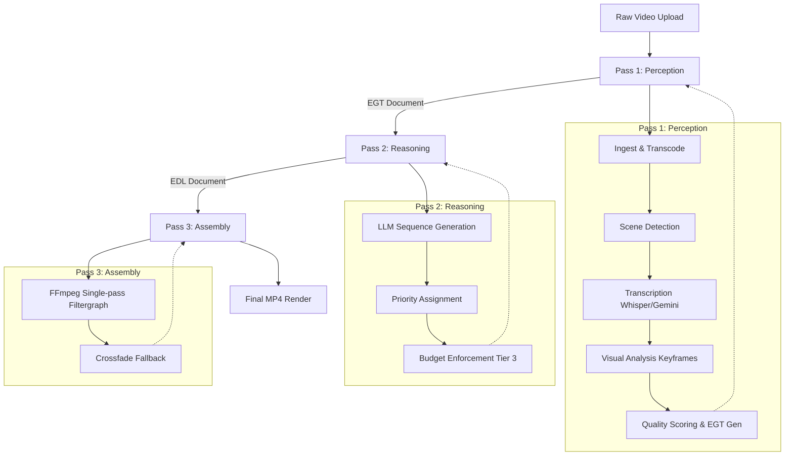
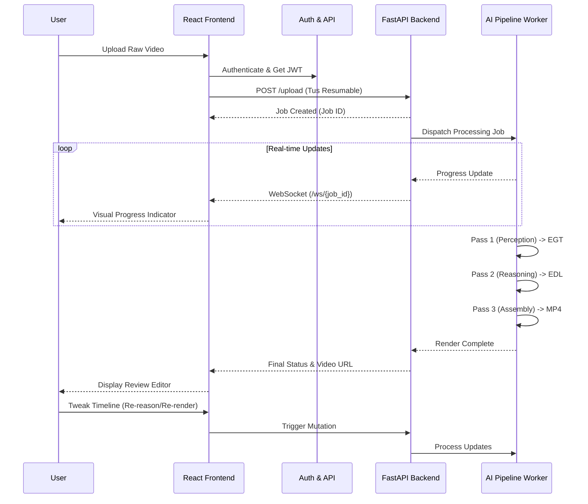

# VlogForge 🎬🤖
[](https://github.com/vlogforge)
[](LICENSE)
[](https://www.python.org/)
[](https://reactjs.org/)

**VlogForge** is a production-grade, AI-powered vlog creation tool designed to automate the heavy lifting of video editing. It processes raw video uploads, semantically analyzes their content, sequences the best takes based on narrative priority, and renders a final vlog-style edit.

Built as a monorepo, VlogForge features a robust **Python FastAPI** backend housing an advanced neurosymbolic AI pipeline, and a modern **React + Vite** frontend providing a seamless drag-and-drop workflow and a timeline review editor.

---

## 🏗️ Architecture Overview

The repository is structured as a monorepo containing two main parts:

- **`backend/`**: A Python FastAPI application that runs the core AI editing pipeline. It integrates heavily with LLMs (Google Gemini), local machine learning models (`faster-whisper`), and `FFmpeg`.
- **`frontend/`**: A React 18 single-page application bundled with Vite. It features a drag-and-drop upload interface, real-time WebSocket progress monitoring, and a fully featured video timeline editor for reviewing and tweaking edits.

### 📐 Project Diagrams & Schematics

We maintain a set of [Excalidraw](https://excalidraw.com) diagrams outlining the architecture, phases, and implementation plans. You can view them by importing them into Excalidraw:

- 🏗️ **[Architecture & Data Flow](./vlogforge-architecture.excalidraw)**: High-level overview of backend microservices, pipeline steps, and frontend communication.
- 🛣️ **[Phase Plan](./vlogforge-phase-plan.excalidraw)**: Breakdown of the development phases and feature rollout.
- ⚙️ **[Implementation Plan](./vlogforge-implementation-plan.excalidraw)**: Detailed module-level implementation strategy.
- 🔍 **[M4 Comparison](./vlogforge-m4-comparison.excalidraw)**: Technical performance comparison across different architectural choices.
- 🔄 **[Refined Workflow](./vlogforge-refined.excalidraw)**: The refined workflow architecture for processing pipelines.

---

## 🧠 The AI Pipeline (3 Passes, 8 Stages)

VlogForge uses a sophisticated 3-pass pipeline to transform raw video into a polished vlog.



### Pass 1: Perception (Tier 1)
Generates an **Extended Genre Transcript (EGT)** that contains a complete structural, auditory, and visual understanding of the raw footage.
1. **Ingest**: Computes file hashes, transcodes to CFR (Constant Frame Rate) 30fps, extracts WAV audio, and runs initial processing.
2. **Scene Detection**: A two-pass cascade detector using PySceneDetect (hard cuts + adaptive detection) to subdivide the video into logical segments.
3. **Transcription**: Speech-to-text using Gemini Flash Lite STT with a local `faster-whisper` fallback. Features a two-pointer sweep algorithm to perfectly align transcript words to scene boundaries.
4. **Visual Analysis**: Leverages Gemini Vision via dense sampling (extracting keyframes at intervals) to generate chronological timeline descriptions, tracking subjects entering/leaving the frame.
5. **Quality Scoring**: Assigns semantic segment types and applies rule-based heuristics (disfluency, bad-take phrases, noise) to generate a quality score for each segment.
6. **EGT Construction**: Validates and builds the final EGT document used for reasoning.

### Pass 2: Reasoning (Tier 2 & 3)
Generates the **Edit Decision List (EDL)** using a Neurosymbolic Propose-and-Repair Architecture to decide what makes it into the final video.
7. **EDL Generation**:
   - **Tier 2 (Propose)**: Calls an LLM to sequence the narrative, assigning priorities (`LOW`, `MEDIUM`, `CRITICAL`) and setting core clip boundaries.
   - **Tier 3 (Repair)**: A deterministic Python constraint solver enforces exact duration budgets. It executes a 5-phase fallback algorithm to trim padding, drop lower-priority clips based on quality scores, and prevent jump cuts, ensuring the final edit meets user constraints without losing critical narrative payload.

### Pass 3: Assembly
8. **Assembly**: Executes the proposed EDL via FFmpeg. Employs a single-pass filtergraph approach for speed, with multi-pass crossfade fallback for complex transitions.

---

## 🔄 Core Workflow



---

## 🚀 Getting Started

### Prerequisites
- **Node.js** (v18+)
- **Conda** (Miniconda/Anaconda)
- **FFmpeg** installed and available in your system path
- **Google Gemini API Key**

### 1. Setup the Backend
The backend runs on Python and uses a Conda environment for dependency management.

```bash
# Navigate to workspace root
cd vlogforge

# Create the conda environment
conda env create -f environment.yml
conda activate vlogforge

# Navigate to the backend directory
cd backend

# Setup environment variables
# Ensure you create a .env file containing your GEMINI_API_KEY
echo "GEMINI_API_KEY=your_api_key_here" > .env

# Run the FastAPI development server
uvicorn app.main:app --reload --port 8000
```
The backend will be available at `http://localhost:8000`.

### 2. Setup the Frontend
The frontend is a React application served via Vite.

```bash
# Navigate to the frontend directory
cd frontend

# Install dependencies
npm install

# Start the development server
npm run dev
```
The frontend will be available at `http://localhost:5173`.

---

## 🛠️ Diagnostics & Debugging

The backend contains several standalone CLI tools (located in the `backend/` directory) for verifying environment setup and debugging pipeline outputs without running the full server:

- **`debug_pipeline.py`**: Inspects a job log and performs 3-way transcript comparison (Raw vs EGT vs EDL) to debug missing cuts and A/V sync drift.
- **`check_egt.py`**: Validates and pretty-prints an EGT JSON file to debug perception output.
- **`dump_egt.py` & `summarize_egt.py`**: Tools for viewing and summarizing aggregate statistics (segment count, type distribution) from EGT outputs.
- **`check_ffprobe.py`**: Verifies `ffprobe` binary discovery and video metadata parsing capabilities.

---

## 📂 Data Flow & Storage

- **Uploads**: User uploaded raw video files are stored temporarily in `uploads/{job_id}/`.
- **In-Memory State**: Job tracking and EGT/EDL JSON data are held in-memory via `jobs_db` and `jobs_data_db` during execution.
- **Outputs**: Rendered `.mp4` vlog files are saved to the `outputs/` directory.
- **Logs**: Detailed execution logs are stored in the `logs/` directory.

---

## 🤝 Contributing

Contributions are welcome! If you're interested in improving the AI pipeline algorithms, adding support for new rendering techniques, or enhancing the frontend timeline, please open an issue or submit a pull request.

---
*Generated and maintained with ❤️ by the VlogForge Team.*
